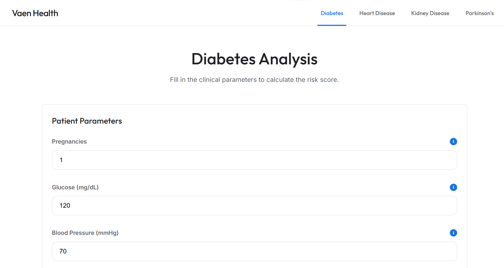
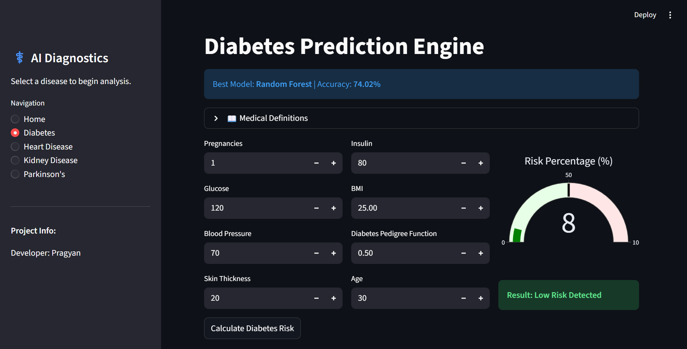

# AI Multi-Disease Predictor  

---

## Overview

AI Multi-Disease Predictor is a modular, end-to-end machine learning system designed to predict disease risk using structured clinical datasets.

The project integrates:

- Data preprocessing pipelines  
- Multi-model benchmarking  
- Statistical evaluation  
- Model serialization  
- Interactive web deployment  

The objective is to demonstrate applied machine learning, structured data analysis, and scalable software design in a healthcare context.

---

## 🌐 Live Application

Interactive Deployment (Streamlit Cloud):

🔗 https://ai-multi-disease-predictor.streamlit.app/

The web application allows users to:

- Select a disease category  
- Input medical parameters  
- Receive real-time prediction results  

---

## 📸 Dashboard Preview

### Main Dashboard


### Diabetes Prediction Interface


---

## 📊 Supported Disease Categories

The system predicts:

-  Kidney Disease  
-  Parkinson’s Disease  
-  Heart Disease  
-  Diabetes  

Each disease uses its best-performing trained model selected through benchmarking.

---

## 📈 Model Performance Summary

| Disease Category      | Selected Model                 | Accuracy |
|-----------------------|--------------------------------|----------|
| Kidney Disease        | Support Vector Machine (SVM)   | **95.50%** |
| Parkinson’s Disease   | Random Forest                  | **88.20%** |
| Heart Disease         | Random Forest                  | **82.15%** |
| Diabetes              | Random Forest                  | **74.02%** |

### Observations

- SVM achieved highest performance for kidney disease due to strong feature separability.
- Random Forest demonstrated consistent robustness across structured datasets.
- Diabetes prediction indicates potential for improvement via advanced feature engineering and hyperparameter tuning.

---

## Problem Statement

Can structured medical parameters be transformed into reliable predictive models that assist in early disease risk detection?

This project addresses:

- Supervised classification on healthcare datasets  
- Comparative model benchmarking  
- Feature scaling and preprocessing  
- Statistical performance evaluation  
- Real-time deployment of ML models  

---

## End-to-End Machine Learning Pipeline

1. Raw dataset ingestion  
2. Data cleaning & preprocessing  
3. Feature scaling (StandardScaler)  
4. Train-test split  
5. Multi-algorithm training (LR, SVM, RF, KNN)  
6. Model evaluation (Accuracy, Precision, Recall, F1-Score)  
7. Best model selection  
8. Model serialization (.pkl files)  
9. Streamlit-based deployment  

The pipeline is modular and separates data engineering, modeling, and inference layers.

---

## Key Technical Components

### 1. Data Engineering

- Structured dataset handling  
- Missing value processing  
- Feature normalization  
- Reproducible preprocessing logic  

---

### 2. Model Benchmarking

Algorithms evaluated:

- Logistic Regression  
- Support Vector Machine (SVM)  
- Random Forest  
- K-Nearest Neighbors  

Performance metrics used:

- Accuracy  
- Precision  
- Recall  
- F1-Score  

The best-performing model per disease was deployed.

---

### 3. Deployment Architecture

- Trained models serialized using Pickle  
- Streamlit frontend for real-time inference  
- Clean separation between backend ML logic (`src/`) and UI layer (`app/`)  
- Scalable design for adding additional disease modules  

---

## Project Architecture

```
AI_Disease_Predictor/
│
├── app/                      # Streamlit application layer
│   └── streamlit_app.py
│
├── data/
│   ├── raw/                  # Original datasets
│   └── processed/            # Cleaned & split datasets
│
├── models/                   # Serialized trained models
│   ├── diabetes_model.pkl
│   ├── heart_model.pkl
│   ├── kidney_model.pkl
│   ├── parkinsons_model.pkl
│   └── scalers.pkl
│
├── src/                      # Core ML logic
│   ├── data_loader.py
│   ├── preprocess.py
│   ├── train.py
│   └── predict.py
│
├── reports/                  # Model comparison & dashboard previews
│
├── requirements.txt
└── README.md
```

The architecture emphasizes modularity, maintainability, and scalability.

---

## Technology Stack

- Python  
- Pandas  
- NumPy  
- Scikit-learn  
- Streamlit  
- Pickle  

---

## Skills Demonstrated

### Data Science
- Statistical evaluation of classification models  
- Comparative algorithm benchmarking  
- Feature preprocessing and scaling  
- Structured healthcare data analysis  

### Machine Learning
- Supervised learning pipelines  
- Model selection and optimization  
- Deployment-ready ML integration  
- Modular ML system design  

### Data Analytics
- Data cleaning and transformation  
- Performance metric interpretation  
- Insight extraction from evaluation results  

### Software Engineering
- Modular project architecture  
- Separation of concerns  
- Model serialization and deployment workflow  
- Maintainable folder structure  

---

## How to Run Locally

Clone the repository:

```bash
git clone https://github.com/Vaenvoice/AI_Disease_Predictor.git
cd AI_Disease_Predictor
```

Create a virtual environment:

```bash
python -m venv venv
```

Activate (Windows):

```bash
venv\Scripts\activate
```

Install dependencies:

```bash
pip install -r requirements.txt
```

Run the application:

```bash
streamlit run app/streamlit_app.py
```

---

## Future Improvements

- Probability score display  
- Feature importance visualization  
- SHAP-based explainability  
- Hyperparameter optimization  
- Cross-validation reporting  
- REST API (FastAPI) version  
- Docker containerization  
- CI/CD integration  

---

## Author

Vaenvoice 
Undergraduate student focused on Machine Learning, Data Science, and applied AI systems.
