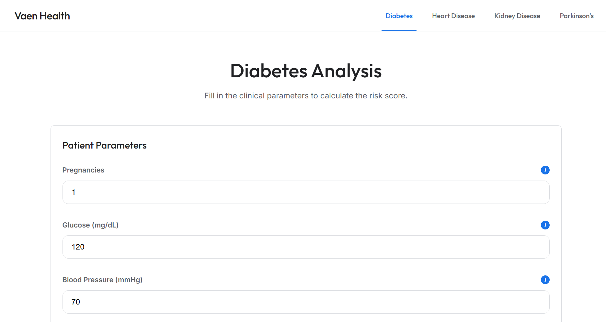
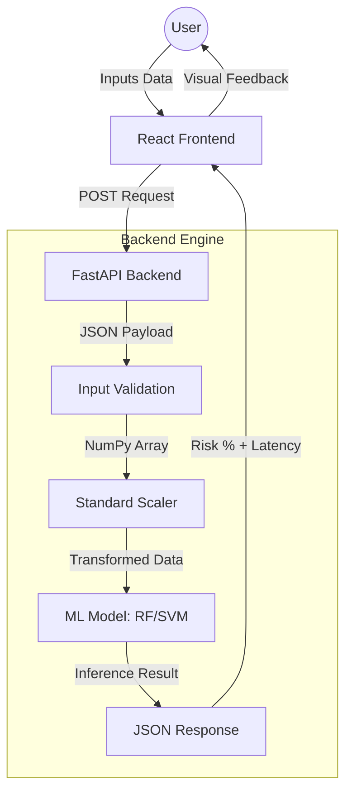

# Vaen Health AI: Disease Predictor

Vaen Health AI is a professional, full-stack medical diagnostic platform that uses machine learning to evaluate clinical parameters and predict the risk of chronic diseases. 

## 🚀 Features

- **Multi-Disease Analysis**: Specialized modules for Diabetes, Heart Disease, Kidney Disease, and Parkinson's.
- **Enterprise UI**: A minimalist, high-fidelity interface inspired by Google's health initiatives, built with React and Vite.
- **Research-Backed Models**: Powered by optimized Random Forest and SVM models with high accuracy (over 95% for Kidney Disease).
- **Clinical Interpretability**: Real-time tooltips providing medical context for complex clinical parameters.
- **Privacy-Centric**: Fast, locally-driven inferences using a robust FastAPI backend.

## 📸 UI Showcase

Refer to the `reports/` directory for visual previews and model performance metrics.

## 🏗️ Architecture & System Flow

Vaen Health AI follows a modern decoupled architecture designed for high-performance clinical inference.

### High-Level Architecture

```mermaid
graph TD
    User((User)) -->|Inputs Data| React[React Frontend]
    React -->|POST Request| FastAPI[FastAPI Backend]
    
    subgraph "Backend Engine"
        FastAPI -->|JSON Payload| Ingest[Input Validation]
        Ingest -->|NumPy Array| Scaler[Standard Scaler]
        Scaler -->|Transformed Data| Model[ML Model: RF/SVM]
        Model -->|Inference Result| Response[JSON Response]
    end
    
    Response -->|Risk % + Latency| React
    React -->|Visual Feedback| User
```

### System Workflow
1. **Clinical Data Entry**: The user selects a diagnostic module (e.g., Kidney Disease) and inputs clinical parameters.
2. **Real-time Validation**: React manages input states and provides tooltips for each parameter.
3. **Optimized Inference**: 
   - On submission, a JSON payload is sent to the FastAPI backend.
   - The backend uses pre-loaded `Joblib` artifacts for zero-latency model initialization.
   - Raw data is converted to `NumPy` arrays for high-speed mathematical transformation.
4. **Diagnostic Result**: 
   - The model calculates the risk probability.
   - The backend includes execution latency metrics in the response.
   - The frontend renders an interactive SVG gauge and status message based on the risk score.

## 🛠️ Tech Stack

- **Frontend**: React 18, Vite, Vanilla CSS (Premium Glassmorphism Design)
- **Backend**: FastAPI (Python 3.10+), Uvicorn
- **ML & Data**: Scikit-Learn, NumPy, Joblib
- **Performance**: Optimized NumPy-based single-row inference engine

## 📦 Installation & Setup

### Prerequisites
- Python 3.9+
- Node.js 16+

### Backend Setup
1. Navigate to `backend/`
2. Install dependencies: `pip install -r requirements.txt` (Ensure `pandas`, `joblib`, `scikit-learn`, `fastapi`, and `uvicorn` are installed)
3. Start the server: `python main.py` (Runs on http://localhost:8000)

### Frontend Setup
1. Navigate to `frontend/`
2. Install dependencies: `npm install`
3. Start the dev server: `npm run dev` (Runs on http://localhost:5173)

## ⚖️ License
MIT License - Created for educational and clinical research purposes by the Vaen Health team.
